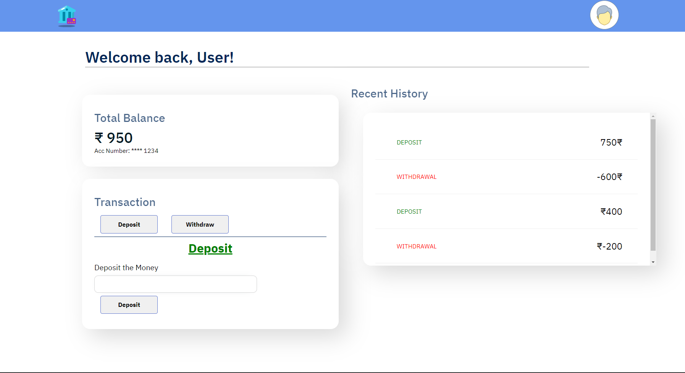

# Expense tracker
### A simple webpage that keeps a track of the expenses. 
### Working: 
  - add and remove expenses and save to local storage
  - show balances, expense and income totals
  - display transaction items in DOM
### Built with
  - Semantic HTML5 markup
  - CSS custom properties
  - JavaScript
### Links:
Link of the hosted webpage https://expenses-managing.netlify.app/
### ScreenShot 

